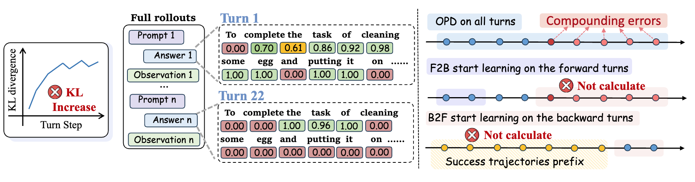
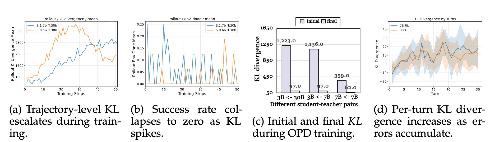
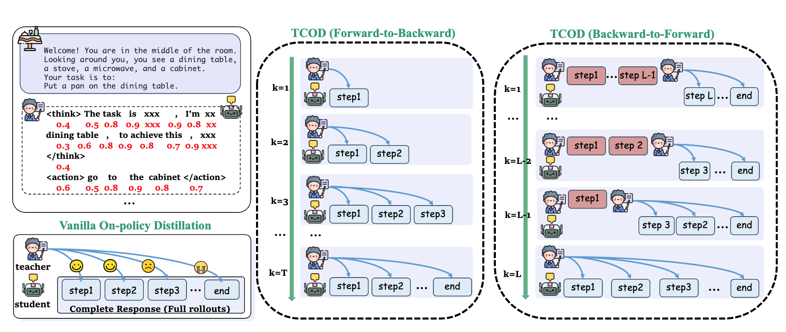

<p align="center">
<h1 align="center"> TCOD: Exploring Temporal Curriculum in On-Policy Distillation for Multi-turn Autonomous Agents</h1>
</p>

<p align="center">
  <a href="https://arxiv.org/abs/2604.24005" target="_blank"></a>
  <a href="https://modelscope.cn/collections/wjqkoko/TCOD" target="_blank"></a>
  <a href="https://huggingface.co/collections/kolerk/tcod" target="_blank"></a>
</p>

<p align="center">
  
</p>

Official codebase for **TCOD**, a temporal curriculum framework for on-policy distillation that stabilizes knowledge transfer from teacher to student agents in multi-turn interactive environments.

---

## 🔥 News

- **[2026-04]** Paper released on arXiv: [arXiv:2604.24005](https://arxiv.org/abs/2604.24005). Code and models are now public!

---

## Introduction

On-policy distillation has emerged as a promising approach to transfer capabilities from large teacher models to smaller student agents. However, in **multi-turn** agent settings (e.g., ALFWorld, WebShop, ScienceWorld), standard distillation suffers from **Trajectory-Level KL Instability**: as the student explores longer interaction trajectories, compounding errors push the student's distribution far from the teacher's, making the supervision signal unreliable and causing performance collapse.

<p align="center">
  
</p>


**TCOD** (Temporal Curriculum for On-Policy Distillation) addresses this with a simple but effective idea: instead of exposing the full trajectory to the student from the start, TCOD applies a **temporal curriculum** that progressively expands the trajectory depth during training — from short, stable prefixes to complete multi-turn rollouts. This keeps the student within the teacher's guidance range throughout training.

TCOD offers two complementary trajectory ordering strategies:
- **TCOD-b2f** (Backward-to-Forward): starts distillation from the *later* steps of a trajectory, where the task outcome is clearer, and progressively extends supervision toward the beginning.
- **TCOD-f2b** (Forward-to-Backward): starts from the *early* steps where the student is most on-distribution, and gradually extends to longer horizons.

<p align="center">
  
</p>

**Key results** across three benchmarks:
- Up to **+18 points** improvement over standard on-policy distillation (OPD)
- Significantly more stable KL divergence curves throughout training
- Student agents that **surpass their teachers** on several tasks
- Better generalization to tasks where the teacher itself fails

---

## What Is Implemented

The following items are implemented in this repo and wired to runnable configs:

- Multi-turn OPD workflows for all 3 environments
- TCOD-b2f workflows for all 3 environments
- TCOD-f2b workflows for all 3 environments
- Distillation signal based on student vs teacher token-level logprobs
- Example configs under `TCOD_examples/*`

Not included here: unimplemented TCOD ideas or extra variants not present in code/config.

---

## Repository Layout

```text
opd_multi_turn/
├── TCOD_examples/
│   ├── alfworld/
│   │   ├── opd.yaml
│   │   ├── tcod_b2f.yaml
│   │   └── tcod_f2b.yaml
│   ├── webshop/
│   │   ├── opd.yaml
│   │   ├── tcod_b2f.yaml
│   │   └── tcod_f2b.yaml
│   └── scienceworld/
│       ├── opd.yaml
│       ├── tcod_b2f.yaml
│       └── tcod_f2b.yaml
└── trinity/common/workflows/envs/TCOD/
    ├── alfworld/
    ├── webshop/
    └── scienceworld/
```

---

## Installation

### 1) Create environment

```bash
conda create -n opd-mt python=3.10
conda activate opd-mt
```

### 2) Install project

```bash
pip install -e ".[dev]"
pip install flash-attn==2.8.1 --no-build-isolation
```

If you do not use GPU/flash-attn, adjust installation based on your runtime environment.

---

## Environment Setup

All example YAMLs use placeholder paths. You must update them first. At minimum, check these fields in the selected config:

- `model.model_path` (student model)
- `explorer.auxiliary_models[0].model_path` (teacher model)
- `buffer.explorer_input.taskset.path` (train data)
- `buffer.explorer_input.eval_tasksets[*].path` (eval data, if enabled)

Environment-specific setup instructions are below.

### ALFWorld

**Step 1: Install alfworld**

```bash
pip install alfworld
```

**Step 2: Download data**

```bash
# Option 1: Auto download to ~/.cache/alfworld/
alfworld-download

# Option 2: Specify download path
alfworld-download --data-dir ./alf-data
```

**Step 3: Configure data path**

Edit `TCOD_examples/alfworld/get_alfworld_data.py`:

```python
# Modify to your actual data path
alfworld_data_root = "/your/local/path/alfworld/json_2.1.1"
```

> **Note**: Keep `json_2.1.1` at the end of the path.

**Step 4: Process data**

```bash
cd TCOD_examples/alfworld
python get_alfworld_data.py
```

Processed data will be saved to `TCOD_examples/alfworld/alfworld_data/`.

---

### WebShop

> **Note**: WebShop requires ~1TB memory. Skip if resources are limited.

**Step 1: Clone WebShop repository**

```bash
git clone https://github.com/princeton-nlp/webshop.git webshop
cd webshop
```

**Step 2: Install Java 17+**

```bash
# Using conda
conda install -c conda-forge openjdk=17
```

**Step 3: Run setup script**

```bash
# Small dataset (recommended for testing)
./setup.sh -d small

# Full dataset
./setup.sh -d all
```

Note that some Python dependencies may conflict — install them individually if needed.

**Step 4: Process data**

```bash
cd TCOD_examples/webshop
python get_webshop_data.py
```

**Step 5: Configure WebShop path**

Option A: Set environment variable

```bash
export WEBSHOP_PATH=/path/to/webshop
```

Option B: Modify workflow files directly

Edit path in all WebShop workflow files (`trinity/common/workflows/envs/TCOD/webshop/*.py`):

```python
# Find this line and update the path
sys.path.append("/your/path/to/webshop")
```

---

### ScienceWorld

**Step 1: Clone and install ScienceWorld**

```bash
git clone https://github.com/allenai/ScienceWorld.git
cd ScienceWorld
pip install .
```

**Step 2: Configure jar path**

Edit `TCOD_examples/scienceworld/get_sciworld_data.py`:

```python
# Set the jar path to your ScienceWorld directory
jar_path = "/your/path/ScienceWorld/scienceworld/scienceworld.jar"
```

**Step 3: Process data**

```bash
cd TCOD_examples/scienceworld
python get_sciworld_data.py
```

---

## Quick Start

### 1) Start Ray

```bash
ray start --head
```

### 2) Run one experiment

```bash
# ALFWorld - OPD
trinity run --config TCOD_examples/alfworld/opd.yaml

# ALFWorld - TCOD-b2f
trinity run --config TCOD_examples/alfworld/tcod_b2f.yaml

# ALFWorld - TCOD-f2b
trinity run --config TCOD_examples/alfworld/tcod_f2b.yaml
```

You can switch to `webshop` or `scienceworld` by replacing the config path.

---

## Supported Experiment Matrix

| Environment | OPD | TCOD-b2f | TCOD-f2b |
| --- | --- | --- | --- |
| ALFWorld | `TCOD_examples/alfworld/opd.yaml` | `TCOD_examples/alfworld/tcod_b2f.yaml` | `TCOD_examples/alfworld/tcod_f2b.yaml` |
| WebShop | `TCOD_examples/webshop/opd.yaml` | `TCOD_examples/webshop/tcod_b2f.yaml` | `TCOD_examples/webshop/tcod_f2b.yaml` |
| ScienceWorld | `TCOD_examples/scienceworld/opd.yaml` | `TCOD_examples/scienceworld/tcod_b2f.yaml` | `TCOD_examples/scienceworld/tcod_f2b.yaml` |

---

## Workflow Names in Config

Each YAML selects workflow by `buffer.explorer_input.default_workflow_type`:

- OPD:
  - `OPD_alfworld_workflow`
  - `OPD_webshop_workflow`
  - `OPD_scienceworld_workflow`
- TCOD-b2f:
  - `TCOD_b2f_alfworld_workflow`
  - `TCOD_b2f_webshop_workflow`
  - `TCOD_b2f_scienceworld_workflow`
- TCOD-f2b:
  - `TCOD_f2b_alfworld_workflow`
  - `TCOD_f2b_webshop_workflow`
  - `TCOD_f2b_scienceworld_workflow`

---

## Key Config Notes

- `algorithm.advantage_fn` should stay `multi_turn_opd` for these workflows.
- `rollout_args.logprobs` must be enabled (e.g., `0`) for distillation gap computation.
- TCOD configs currently use `workflow_args.checkpoint_strategy: linear`.
- Typical knobs you may tune:
  - `buffer.total_steps`
  - `trainer.total_steps`
  - `workflow_args.max_env_steps`
  - `workflow_args.checkpoint_steps` (TCOD)

---

## Outputs

By default, experiments write checkpoints under:

- `checkpoint_root_dir` (usually `./checkpoints`)

And logging/monitor settings are controlled by:

- `monitor.monitor_type` (e.g., `wandb`)

---

## Citation

```bibtex
@article{wang2026tcod,
  title   = {TCOD: Exploring Temporal Curriculum in On-Policy Distillation for Multi-turn Autonomous Agents},
  author  = {Jiaqi Wang and Wenhao Zhang and Weijie Shi and Yaliang Li and James Cheng},
  journal = {arXiv preprint arXiv:2604.24005},
  year    = {2026}
}
```
